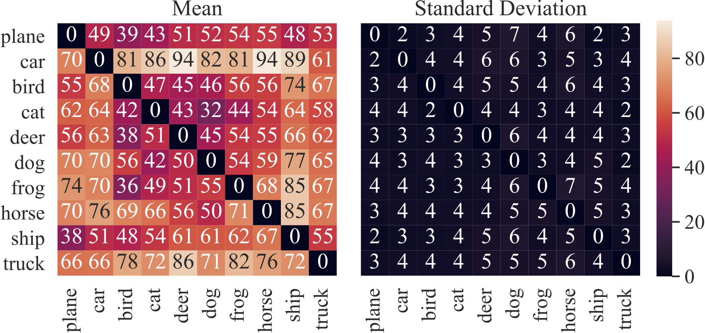
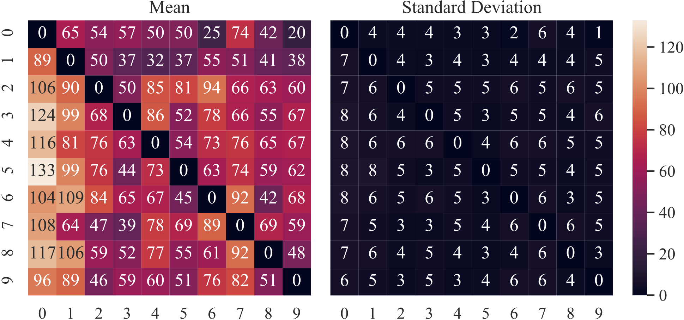
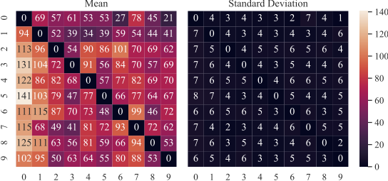
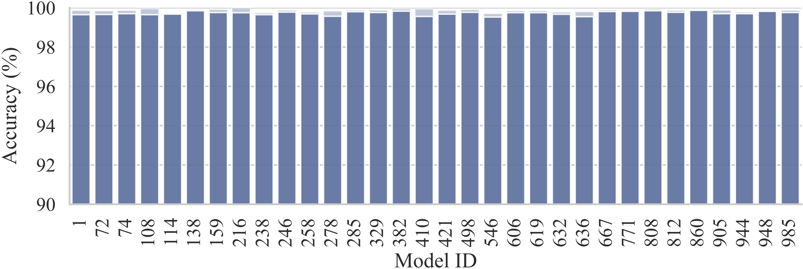
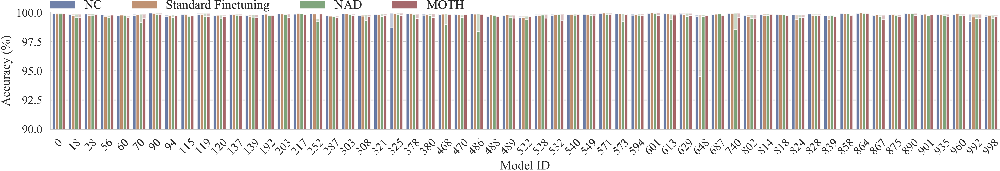
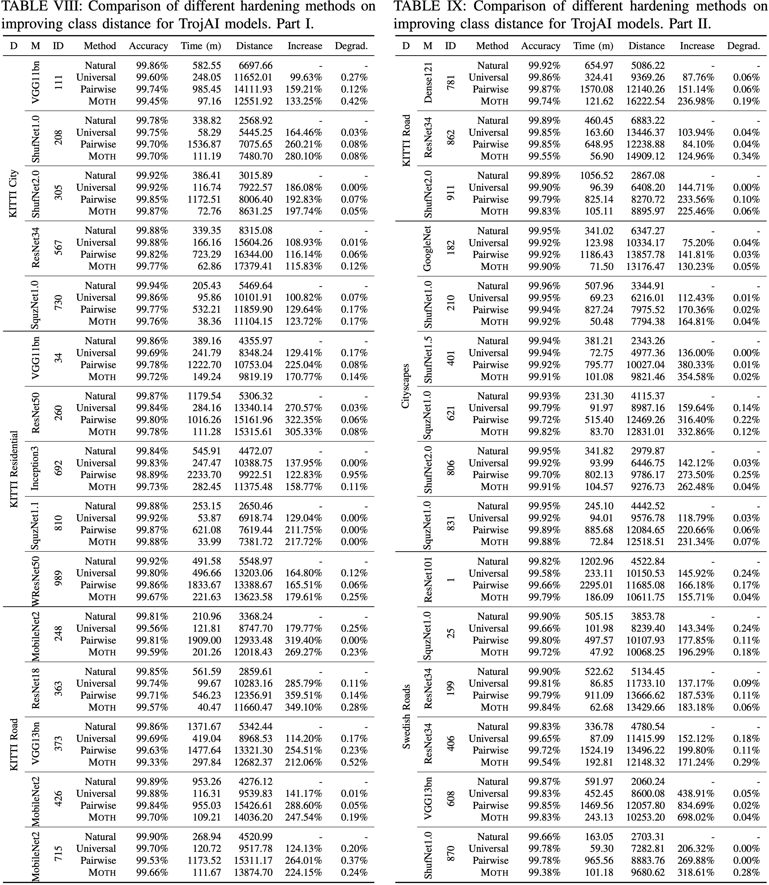

# MOTH

Supplementary material for paper *Model Orthogonalization: Class Distance Hardeningin Neural Networks for Better Security*

## Stability of Class Distance

We study the stability of class distance by using different sets/numbers of samples on CIFAR-10 and SVHN. Figure 1 shows the results for CIFAR-10 using 200 random samples. Figures 2 and 3 show results for SVHN using 100 and 200 samples, respectively. The heat maps on the left denote the means of class distances for all pairs and the heat maps on the right denote the standard deviations. Observe that the standard deviations of class distances are small for using 200 random samples (4.50) for the measurement, rendering the class distance measure quite stable. The average distances is 61.31. The observation is the same for SVNH using 100 samples (69.25±5.42) and using 200 samples (73.43±5.15).

Figure 1: Mean and standard deviation of class distances for 100 different sets of 200 random samples for a naturally trained ResNet20 model on CIFAR-10

Figure 2: Mean and standard deviation of class distances for 100 different sets of 100 random samples for a naturally trained NiN model on SVHN

Figure 3: Mean and standard deviation of class distances for 100 different sets of 200 random samples for a naturally trained NiN model on SVHN

## Normal Accuracy of TrojAI Models

Figure 4 shows the normal accuracy of false positive models reported by top-performers' scanner in Section VI-A before and after applying MOTH. The x-axis denotes the model IDs and the y-axis denotes the accuracy. Bars in the light colors denote the accuracy of models before applying MOTH and the dark color after. The accuracy degradation is 0.13% on average.

Figure 4: Normal accuracy of false positive models

Figure 5 shows the normal accuracy of poisoned models before and after applying each backdoor-erasing technique. Bars in the light colors denote the accuracy of poisoned models before erasing/hardening and the dark color after. We can observe that the accuracy degradation is minimal (<0.5% for most cases). The average accuracy degradation is less than 0.2% for all the techniques.

Figure 5: Normal accuracy of poisoned models before/after repair

Caption goes here

